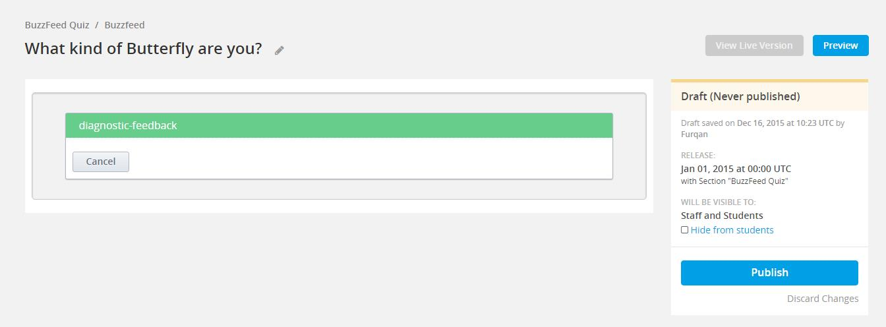
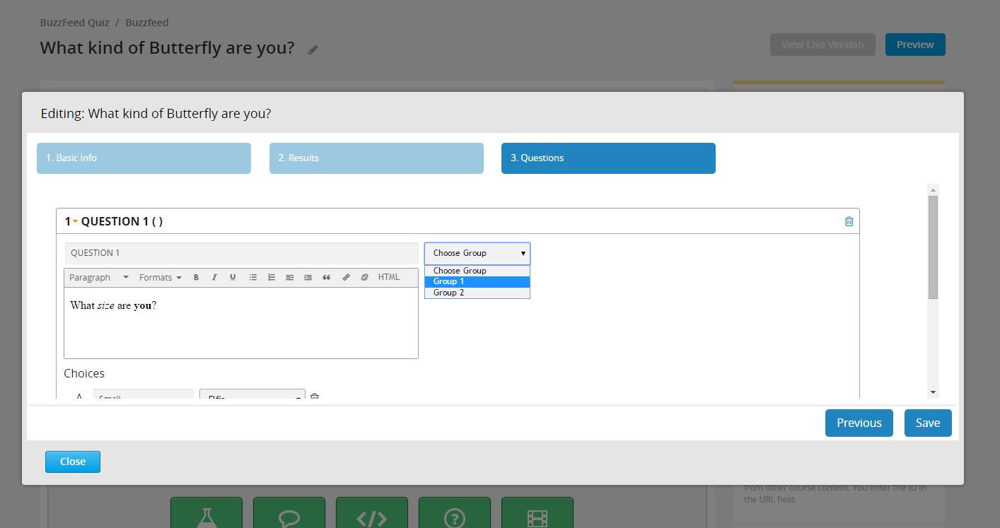

BuzzFeed Style Quiz
-------------------

Following is a step-by-step explanation of the authoring process:

1.  In order to author a BuzzFeed-Styled quiz, first select the ‘diagnostic-feedback’
    from the list of [Advanced] under [Add new component]:

    

    Note the unit name – it should be the quiz title question.

2.  Click [Edit] to bring up the quiz editor popup. Enter the same title
    question as the Quiz title (for analytic purposes). Select ‘BuzzFeed-style’
    in the [Quiz Type] drop-down. Another thing to note here is that once set,
    this type cannot be changed during subsequent edits of this Quiz.

     ![Type]  (img/buzzfeed/step-1.jpg)

3.  After adding description below [Quiz Type]. Click the [Next] button. Hitting
    ‘Next’ at any step of this wizard saves the current values. This will take you
    to the screen to define your categories (results)

    ![category_1]    (img/buzzfeed/result-1.jpg)
    ![category_2]    (img/buzzfeed/result-2.jpg)
    ![category_3]    (img/buzzfeed/result-3.jpg)

    1.  Category Name (for internal use only, not visible to students)
    2.  Image Url (Can use both relative edX links or absolute HTTP links)
    3.  Group Title (Only one group can be added or attached to each category,
        more on this later)
    4.  Notes (for internal use only, not visible to students)
    5.  Description (HTML displayed as the result if respective category is
        calculated as the final feedback)
    6.  Delete Category (If there is only one category left, it cannot be deleted)
    7.  Add Category
    8.  Drag collapsed categories to order them with their priority in case of a
        tie-breaker in results



4.  After adding desired categories, hit [Next]. Once again, this will save your
    quiz data to this point. On the other hand, by clicking [Previous] you will
    lose all data on the current step. 
Now you can add questions along with their
    choices for your quiz:

    ![Question_1]    (img/buzzfeed/question-1.jpg)
    ![Question_2]    (img/buzzfeed/question-2.jpg)

    1.  Question Title
    2.  Question Text
    3.  Question Group (If you have defined groups in the previous step, select
        the appropriate group, otherwise select ‘Default Group’. More on this later)
    4.  Delete Question (This will delete the complete question with all its choices.
        If there is only one question, it cannot be deleted)
    5.  Choice Text
    6.  Category/Result for respective choice
    7.  Delete Choice
    8.  Add a Choice
    9.  Add Question

5.  After adding all the questions with their choices, hit [Save] to finish
    authoring this quiz. You should be able to see the quiz rendered as visible
    to a student immediately:


    ![Preview] (img/buzzfeed/preview-question.jpg)

Groups in BuzzFeed Quiz
------------------------

A new group can be simply added and attached simultaneously to a
category by typing the desired name in the group field and clicking
the ‘+’ button that appears next to it:

![result-group-1]    (img/buzzfeed/result-group-1.jpg)
![result-group-2]    (img/buzzfeed/result-group-2.jpg)
![result-group-3]    (img/buzzfeed/result-group-3.png)

    1.  Enter the group name here
    2.  If the group doesn’t exist, a ‘+’ button will appear
    3.  Once a group is attached, the name will be displayed here.
        If no defined group is attached, it will revert to ‘Default Group’.
        This can be done by just removing the current group from the field
    4.  If the group exists, it will be displayed in an auto-complete list
        and can be selected directly

For the next step note that we have assigned ‘Group 1’ to ‘Monarch’ and ‘Swallowtail’.
Once at the questions, we assign each question to one of the groups that we have assigned
to categories in the previous step.

Now you can see that only the groups that were assigned to at least one of the categories
are visible. Groups that were n’t assigned like ‘G Test’, ‘Group 3’ and even the ‘Default Group’
are not available for selection. This prevents assigning questions to an empty group.
Now when we select ‘Group 1’ for QUESTION 1:

![Group_2] (img/buzzfeed/question-group-2.jpg)

The available categories are those which were assigned ‘Group 1’. This practically allows the
author to create completely independent sub-quizzes within each quiz. A question belonging to a
particular group will only increase the score of categories within that group. This leads to
multiple results, one against every single group that has been assigned to at least one category.
Now we can save the quiz after selecting ‘Group 2’ for ‘QUESTION 2’. This will leave us with only
one category ‘Elfin’ for all the choices in the second question.

![Group_3] (img/buzzfeed/question-group-3.jpg)