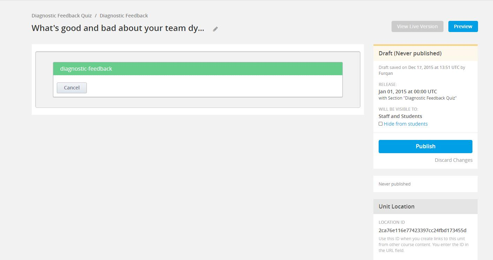

Diagnostic Style Quiz
---------------------

Following is a step-by-step explanation of the authoring process:

1.  In order to author a Diagnostic quiz, first select the ‘diagnostic-feedback’
    from the list of [Advanced] under [Add new component]:


    

    Note the unit name – it should be the quiz title question.

2.  Click [Edit] to bring up the quiz editor popup. Enter the same title question as
    the Quiz title (for analytic purposes). Select ‘Diagnostic-style’ in the [Quiz Type]
    drop-down. Another thing to note here is that once set, this type cannot be changed
    during subsequent edits of this Quiz.

    ![Type]  (img/diagnostic/step-1-type.jpg)

3.  After adding description below [Quiz Type]. Click the [Next] button. Hitting ‘Next’
    at any step of this wizard saves the current values. This will take you to the screen
    to define your ranges (results):


    ![Range] (img/diagnostic/ranges.jpg)

    1.  Range Name (for internal use only, not visible to students)
    2.  Minimum Value for Range
    3.  Maximum Value for Range
    4.  Image Url (Can use both relative edX links or absolute HTTP links)
    5.  Group Title (Only one group can be added and/or attached to each range,
        more on this later)
    6.  Notes (for internal use only, not visible to students)
    7.  Delete Range (If there is only one range left, it cannot be deleted)
    8.  Description (HTML displayed as the result, if respective range is calculated
        as the final feedback)
    9.  Add Range

4.  Like mentioned earlier, two ranges belonging to two different groups can have same or
    overlapping min max values. For example, ‘Range 1’ and ‘Range 3’ both have 0 to 5 as
    the defined range but since ‘Range 1’ belongs to the group ‘Culture’ and ‘Range 3’ belongs
    to ‘Communication’, it is permitted in this case.

    ![Range_1]  (img/diagnostic/result-range-1.jpg)
    ![Range_2]  (img/diagnostic/result-range-2.jpg)

5.  After defining ranges, hit [Next]. Once again, this will save your quiz data to this point.
    On the other hand, by clicking [Previous] you will lose all data on the current step. 
Now you
    can add questions along with their choices for your quiz:


    ![Question_1]    (img/diagnostic/question-1.jpg)
    ![Question_2]    (img/diagnostic/question-2.jpg)

    1.  Question Title
    2.  Question Text
    3.  Question Group (If you have defined groups in the previous step, select
        the appropriate group, otherwise select ‘Default Group’. More on this later)
    4.  Delete Question (This will delete the complete question with all its choices.
        If there is only one question, it cannot be deleted)
    5.  Choice Text
    6.  Choice value
    7.  Delete Choice
    8.  Add a Choice
    9.  Add Question

6.  If there are more than one group defined, their questions need not to be in any order.
    You can also reorder the collapsed questions as they should appear in the quiz:

    ![Questions] (img/diagnostic/question-3.jpg)

7.  After adding all the questions with their choices, hit [Save] to finish authoring
    this quiz. You should be able to see the quiz rendered as visible to a student
    immediately:

    ![preview]  (img/diagnostic/preview-questions.jpg)

Groups in Diagnostic Quiz
-------------------------

A new group can be simply added and attached simultaneously to a range by typing the desired
name in the group field and clicking the ‘+’ button that appears next to it:

![Range_Group_1] (img/diagnostic/range-group-1.jpg)
![Range_Group_2] (img/diagnostic/range-group-2.jpg)

    1.  Enter the group name here
    2.  If the group doesn’t exist, a ‘+’ button will appear
    3.  Once a group is attached, the name will be displayed here. If no defined group
        is attached, it will revert to ‘Default Group’. This can be done by just removing
        the current group from the field
    4.  If the group exists, it will be displayed in an auto-complete list and can be
        selected directly

